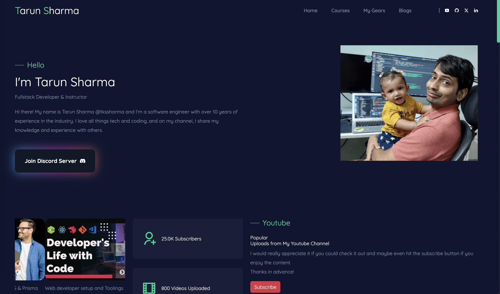

# Tarun Sharma Blog Profile



### Free Open Source BootCamp
This repository is a part of "Free Open Source BootCamp"

### Setting up Locally

1. Copy the `.env.example` to `.env.local`

```bash
cp .env.example .env.local
```

2. Install Packages via yarn

```bash
yarn install
```

3. Run the Next.JS Development Server

```bash
yarn dev
```